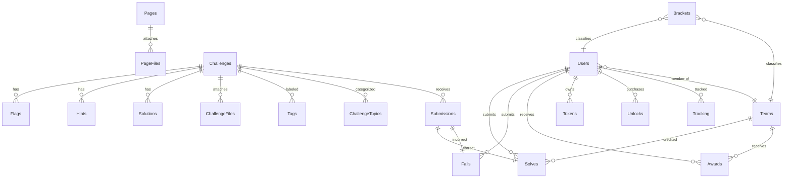

# CTFd Architecture

> **Version:** 3.8.2 · **Channel:** oss · **Framework:** Flask (Python)

## 1. Purpose & Scope

This document explains how the CTFd codebase inside this repository is structured, how runtime components collaborate, and which subsystems you can extend when building custom Capture the Flag experiences. It covers:

- The open-source Flask application under `CTFd/`
- The complete data model (also detailed in [`database_schema.md`](database_schema.md))
- Authentication and session management flows
- The REST API surface and versioning
- Plugin and theme extension points
- Configuration system and environment management
- Deployment topologies and operational considerations
- Security model and hardening options
- Testing infrastructure

---

## 2. System Context

CTFd is a classic monolithic web application exposing two primary surfaces to the outside world.

```mermaid
flowchart LR
    subgraph Clients
        A[Players]
        B[Admins]
        C[Integrations\n(MLC, bots, CI scripts)]
    end
    subgraph CTFd Stack
        D[Flask App\n(CTFd package)]
        E[(Database\nMySQL / PostgreSQL / SQLite)]
        F[(Cache / Redis)]
        G[(Object Storage\nFilesystem or S3)]
        H[Email / OAuth Providers\nSMTP, Mailgun, MLC]
    end
    A -- HTTP/S --> D
    B -- HTTP/S + Admin APIs --> D
    C -- REST API / Tokens --> D
    D <-- SQLAlchemy --> E
    D <-- Flask-Caching --> F
    D <-- Upload Adapter --> G
    D <-- SMTP / APIs --> H
```

**Key data flows:**
- Players and admins hit the Flask UI, which dispatches to blueprints and service helpers.
- The Flask layer persists state via SQLAlchemy ORM (MySQL/PostgreSQL recommended; SQLite for dev/tests).
- Sessions, config objects, and scoreboard fragments are cached in Redis when configured, falling back to filesystem cache for single-node setups.
- Static assets, challenge files, and backups live in local `uploads/` or an S3-compatible bucket.
- Real-time updates (e.g. new notifications, scoreboard changes) are pushed to browsers via Server-Sent Events (SSE).

---

## 3. Application Layer

### 3.1 App Factory & Bootstrap

The entry point is `create_app()` in [`CTFd/__init__.py`](CTFd/__init__.py). It produces a fully wired application instance suitable for testing, WSGI servers, and CLI usage.

**Bootstrap sequence:**

```
create_app()
 ├─ Instantiate CTFdFlask (custom Flask subclass)
 ├─ Load config (ServerConfig / TestingConfig)
 ├─ Init Flask-Caching (Redis or filesystem)
 ├─ Wait if an import is in progress
 ├─ Build layered Jinja2 loader chain
 │    ├─ DictLoader (in-memory overrides)
 │    ├─ ThemeLoader (active theme)
 │    ├─ ThemeLoader (DEFAULT_THEME fallback, if THEME_FALLBACK)
 │    ├─ PrefixLoader (admin + all installed themes)
 │    └─ PrefixLoader { "plugins": FileSystemLoader(plugins/) }
 ├─ Import & init ORM models
 ├─ create_database() → SQLAlchemy engine
 ├─ db.create_all() for SQLite, or upgrade() (Alembic) for others
 ├─ Init Flask-Marshmallow
 ├─ Configure ProxyFix if REVERSE_PROXY set
 ├─ Check ctf_version → run DB migrations if outdated
 ├─ Seed ctf_theme default
 ├─ update_check()
 ├─ init_request_processors / init_template_filters / init_template_globals
 ├─ Register blueprints (views, teams, users, challenges, scoreboard,
 │    auth, api, events, social, admin)
 ├─ Register error handlers (403, 404, 500, 502)
 ├─ init_logs / init_events / init_plugins / init_cli
 └─ return app
```

### 3.2 Custom Flask Classes

| Class | Purpose |
|---|---|
| `CTFdFlask` | Overrides Jinja environment, session interface, request class, and generates a time-based `run_id` for cache busting across workers |
| `CTFdRequest` | Prepends `script_root` to `request.path` so subdirectory deployments work transparently |
| `SandboxedBaseEnvironment` | Sandboxed Jinja2 environment with per-theme template caching using `(loader_weakref, theme/template)` as the cache key |
| `ThemeLoader` | `FileSystemLoader` subclass that routes template loads through theme directories and blocks admin templates from being served by non-admin loaders |

### 3.3 Blueprint & Routing Architecture

All application routes are organized into Flask Blueprints:

| Blueprint | Module | Surface |
|---|---|---|
| `views` | `CTFd/views.py` | Public pages, CMS pages, static HTML |
| `auth` | `CTFd/auth.py` | Registration, login, logout, OAuth, password reset, email confirm |
| `challenges` | `CTFd/challenges.py` | Challenge listing page |
| `users` | `CTFd/users.py` | User profile pages |
| `teams` | `CTFd/teams.py` | Team pages, join/leave/invite flows |
| `scoreboard` | `CTFd/scoreboard.py` | Scoreboard display |
| `share` | `CTFd/share.py` | Challenge share / social metadata endpoints |
| `events` | `CTFd/events.py` | Server-Sent Events stream |
| `admin` | `CTFd/admin/` | Admin panel — all management pages |
| `api` | `CTFd/api/` | REST API (versioned under `/api/v1/`) |

#### REST API Endpoints (`CTFd/api/v1/`)

| Resource | File | Notable operations |
|---|---|---|
| `challenges` | `challenges.py` | CRUD, attempt submission, list by category/tag/topic |
| `users` | `users.py` | CRUD, solves, fails, awards, search |
| `teams` | `teams.py` | CRUD, members, solves, fails, awards, invite |
| `submissions` | `submissions.py` | List/filter all submissions |
| `flags` | `flags.py` | CRUD flag entries per challenge |
| `hints` | `hints.py` | CRUD hints; unlock |
| `unlocks` | `unlocks.py` | Hint/solution unlock transactions |
| `awards` | `awards.py` | CRUD awards |
| `files` | `files.py` | Upload, list, delete |
| `tags` | `tags.py` | CRUD tags |
| `topics` | `topics.py` | CRUD topics |
| `comments` | `comments.py` | Admin comments on entities |
| `notifications` | `notifications.py` | Broadcast notifications (SSE) |
| `pages` | `pages.py` | CMS page CRUD |
| `tokens` | `tokens.py` | API token management |
| `scoreboard` | `scoreboard.py` | Standings (top-N, standings list) |
| `shares` | `shares.py` | Share URL generation |
| `solutions` | `solutions.py` | Challenge solutions CRUD |
| `config` | `config.py` | Admin config key-value CRUD |
| `exports` | `exports.py` | CTF data export trigger |
| `brackets` | (via `statistics/`) | Bracket management |
| `statistics` | `statistics/` | Admin aggregate statistics |

### 3.4 Template System & Themes

The template loading chain is constructed at app startup and allows layered overrides:

```
Request for template "scoreboard.html"
  1. DictLoader (plugin/admin in-memory overrides)
  2. ThemeLoader(active_theme)  → CTFd/themes/<active>/templates/
  3. ThemeLoader(DEFAULT_THEME) → CTFd/themes/core/templates/  (if THEME_FALLBACK)
  4. PrefixLoader  → "admin/" prefix routes to admin theme only
  5. PrefixLoader  → "plugins/*" prefix routes to plugins tree
```

- Admin templates are **namespace-protected**: `ThemeLoader` raises `TemplateNotFound` if a non-admin theme tries to serve an `admin/*` path.
- Template fragments are cached in the `SandboxedBaseEnvironment` with `(theme_name, template_name)` as the key, allowing safe runtime theme switching without stale renders.
- Theme packages live under `CTFd/themes/<theme_name>/` and can contain `templates/`, `static/`, and `translations/`.

---

## 4. Authentication & Authorization

### 4.1 Authentication Flows

CTFd supports three authentication methods:

#### 4.1.1 Local Credential Authentication

```
POST /login
  ├─ Check PRESET_ADMIN_NAME/EMAIL/PASSWORD (env override admin bypass)
  ├─ Look up user by name OR email
  ├─ verify_password(plaintext, bcrypt_hash)
  ├─ session.regenerate()   ← prevents session fixation
  ├─ login_user(user)       ← writes user_id, nonce, admin flag to session
  └─ Redirect → /challenges  (or ?next= if safe URL)
```

Rate limiting: `@ratelimit(method="POST", limit=10, interval=5)` — 10 attempts per 5 s per IP.

#### 4.1.2 OAuth / MajorLeagueCyber (MLC)

```
GET /oauth
  └─ Redirect → MLC authorization endpoint with client_id, scope, state (nonce)

GET /redirect  (OAuth callback)
  ├─ Validate state == session["nonce"]
  ├─ Exchange code for access_token via POST to token endpoint
  ├─ Fetch user profile from MLC API
  ├─ Find or create Users row (with oauth_id, verified=True)
  ├─ In teams_mode: find or create Teams row from MLC team data
  └─ login_user(user)
```

Endpoints and client credentials can be set via `config.ini`, the `config` table, or env vars (`OAUTH_CLIENT_ID`, etc.).

#### 4.1.3 Preset Admin (Headless Bootstrap)

If `PRESET_ADMIN_NAME`, `PRESET_ADMIN_EMAIL`, and `PRESET_ADMIN_PASSWORD` are all set in `config.ini` (under `[management]`), the login endpoint will detect these credentials and call `generate_preset_admin()` to create or retrieve the admin user, bypassing normal DB lookup. Designed for automated provisioning.

### 4.2 Registration Flow

```
GET /register → render registration form
POST /register
  ├─ Validate against num_users cap
  ├─ Validate name, email, password (length, uniqueness, domain allow/blocklist)
  ├─ Validate registration_code (if required)
  ├─ Process custom UserFields entries
  ├─ Validate country, website, affiliation, bracket_id
  ├─ Create Users row; bcrypt password via @validates("password") ORM hook
  ├─ Persist UserFieldEntries
  ├─ login_user(user)
  ├─ If verify_emails: send confirm email → redirect /confirm
  └─ If teams_mode: redirect /teams (join/create team)
```

### 4.3 Session & Token Management

- **Sessions** use `CachingSessionInterface` (stored in Redis/memcached with key prefix `session:`) to support horizontal scaling.
- Each session carries: `id` (user_id), `nonce` (CSRF token), `admin` (bool), `team_id`.
- **API Tokens** (`UserTokens` model): expire after 30 days by default; prefixed with `ctfd_`. Generated/revoked via `/api/v1/tokens`.  Tokens are checked in request processors before session cookies, enabling automation scripts to authenticate.
- **CSRF protection**: every POST checks `session["nonce"]` == form/header nonce. Routes can opt out via `@bypass_csrf_protection`.

### 4.4 Email Flows

| Flow | Trigger | Token lifetime |
|---|---|---|
| Email confirmation | Registration with `verify_emails=true` | No expiry (stored in cache) |
| Password reset | `POST /reset_password` with email | Not specified (standard itsdangerous) |
| Registration notification | Successful registration (if mail configured) | N/A |
| Password change alert | `POST /reset_password/<token>` success | N/A |

Rate limiting also guards password reset attempts per user (5 per 3 min via cache counter).

### 4.5 Authorization Model

| Role | Description |
|---|---|
| Anonymous | Can view public pages; cannot submit or view challenges if CTF not started |
| Authenticated User | Can view/attempt challenges; restricted by CTF timing, `hidden`/`banned` flags |
| Admin (`type="admin"`) | Full access to admin panel and all API endpoints; bypasses challenge visibility and freeze |

Access control decorators (in `CTFd/utils/decorators/`):
- `@admins_only` — requires admin session
- `@authed_only` — requires any authenticated session
- `@during_ctf_time_only` — enforces start/end times
- `@require_verified_emails` — gated on user.verified
- `@check_registration_visibility` — enforces registration open/closed state
- `@ratelimit(method, limit, interval)` — IP-based rate limiting backed by cache counters

---

## 5. Domain & Persistence Layer

### 5.1 ORM Model Overview

All models are defined in `CTFd/models/__init__.py` using SQLAlchemy. They make heavy use of **single-table polymorphism** (discriminator column: `type`) so that plugin-defined subtypes can extend base tables without schema migrations.



### 5.2 Polymorphic Model Families

| Base | Discriminator | Subtypes |
|---|---|---|
| `Users` | `type` | `user`, `admin` → `Admins` |
| `Challenges` | `type` | `standard`, `dynamic` (plugin), custom |
| `Flags` | `type` | `static`, `regex` (via `CTFd/plugins/flags/`) |
| `Hints` | `type` | `standard`, custom |
| `Awards` | `type` | `standard`, custom |
| `Files` | `type` | `standard`, `challenge`, `page`, `solution` |
| `Submissions` | `type` | `correct`→`Solves`, `incorrect`→`Fails`, `partial`, `discard`, `ratelimited` |
| `Unlocks` | `type` | `hints`→`HintUnlocks`, `solutions`→`SolutionUnlocks` |
| `Tokens` | `type` | `user`→`UserTokens` |
| `Comments` | `type` | `challenge`, `user`, `team`, `page` |
| `Fields` | `type` | `user`→`UserFields`, `team`→`TeamFields` |
| `FieldEntries` | `type` | `user`→`UserFieldEntries`, `team`→`TeamFieldEntries` |

> `Challenges` uses a custom `alt_defaultdict` as its polymorphic map to gracefully handle unknown plugin challenge types by falling back to `"standard"` instead of raising a `KeyError`.

### 5.3 Dynamic & Static Scoring

The `Challenges` table stores scoring parameters inline:

| Field | Meaning |
|---|---|
| `value` | Current point value (updated by scoring engine) |
| `initial` | Starting score for dynamic challenges |
| `minimum` | Floor score |
| `decay` | Solve count at which score reaches minimum |
| `function` | Decay function: `static`, `linear`, `logarithmic` |
| `logic` | Flag logic: `any` (any flag matches), `all` (all flags required) |

Score recalculation happens via the challenge plugin's `calculate_value()` method on every new solve.

### 5.4 Database Lifecycle

- `CTFd/config.py` builds the DB URL from `DATABASE_URL` env/config or from individual `DATABASE_HOST/USER/PASSWORD/PORT/NAME` parts (defaults to SQLite).
- **SQLite**: `db.create_all()` + Alembic stamp (no migrations run).
- **MySQL/PostgreSQL**: Alembic `upgrade()` runs all pending migrations; `docker-entrypoint.sh` automates this before gunicorn starts.
- Connection pooling: `max_overflow=20`, `pool_pre_ping=True` (configurable via `config.ini`).
- MySQL-specific: `DATETIME(6)` compiler override for millisecond precision timestamps.
- `migrations/` holds all Alembic revision files. `CTFd/utils/migrations.py` provides `create_database()` and `stamp_latest_revision()`.

### 5.5 Files & Object Storage

Upload behavior is controlled by `UPLOAD_PROVIDER`:

| Provider | Config keys | Notes |
|---|---|---|
| `filesystem` (default) | `UPLOAD_FOLDER` | Stored under `CTFd/uploads/`; served by Flask or nginx |
| `s3` | `AWS_ACCESS_KEY_ID`, `AWS_SECRET_ACCESS_KEY`, `AWS_S3_BUCKET`, `AWS_S3_ENDPOINT_URL`, `AWS_S3_REGION`, `AWS_S3_CUSTOM_DOMAIN`, `AWS_S3_CUSTOM_PREFIX`, `AWS_S3_ADDRESSING_STYLE` | S3-compatible (MinIO, Cloudflare R2, etc.) |

The `Files` model stores `sha1sum` for deduplication. File download URLs are handled by the provider abstraction so that S3 URLs can be pre-signed transparently.

### 5.6 Caching & Sessions

`CTFd/cache/__init__.py` extends Flask-Caching:

| Cache backend | When used |
|---|---|
| `redis` | When `REDIS_URL` or `REDIS_HOST` is configured |
| `filesystem` | Single-node fallback (`.data/filesystem_cache/`) |
| `simple` | Testing only |

**Extra cache methods:**
- `cache.inc(key)` / `cache.expire(key, seconds)` — atomic Redis counters used for rate limiting and password-reset attempt tracking.
- `@cache.memoize()` — function-level LRU cache used on `Users.get_score()`, `Users.get_place()`, `Teams.get_score()`, `Teams.get_place()`.

**Cache invalidation helpers** (called after state changes):

| Function | Busts |
|---|---|
| `clear_standings()` | Scoreboard standings |
| `clear_challenges()` | Challenge listings and caches |
| `clear_pages()` | CMS page cache |
| `clear_config()` | Config key-value cache |
| `clear_user_session(user_id)` | Forces session re-read for a user |
| `clear_team_session(team_id)` | Forces session re-read for a team |

---

## 6. Extension Surface

### 6.1 Plugin System

`CTFd/plugins/__init__.py` `init_plugins(app)` function:
1. Scans `CTFd/plugins/<name>/` directories (excludes `__pycache__`).
2. Imports each as a Python module and calls `module.load(app)`.
3. Skips all plugins if `SAFE_MODE=true`.

**Plugin API surface (callable inside `load(app)`):**

| Function | Effect |
|---|---|
| `register_plugin_assets_directory(app, base_path)` | Serve a static directory at `/<base_path>/<path>` |
| `register_plugin_asset(app, asset_path)` | Serve a single file |
| `override_template(name, html)` | Replace a Jinja template with custom HTML at runtime |
| `override_function(name, func)` | Replace a Python helper function |
| `register_plugin_script(url)` | Inject `<script>` into public theme `base.html` |
| `register_plugin_stylesheet(url)` | Inject `<link>` into public theme `base.html` |
| `register_admin_plugin_script(url)` | Inject `<script>` into admin theme `base.html` |
| `register_admin_plugin_stylesheet(url)` | Inject `<link>` into admin theme `base.html` |
| `register_admin_plugin_menu_bar(title, route)` | Add item to admin navbar |
| `register_user_page_menu_bar(title, route)` | Add item to player navbar |
| `bypass_csrf_protection(view_func)` | Decorate a route to skip CSRF check (e.g. webhooks) |

**Built-in plugins:**

| Plugin | Location | Function |
|---|---|---|
| `challenges` | `CTFd/plugins/challenges/` | Base `BaseChallenge` class; `get_chal_class(type)` registry |
| `dynamic_challenges` | `CTFd/plugins/dynamic_challenges/` | Dynamic (decaying) scoring challenge type |
| `flags` | `CTFd/plugins/flags/` | `BaseFlag` class; `static` and `regex` implementations |

### 6.2 Challenge Type Extension

To create a new challenge type, a plugin:
1. Subclasses `BaseChallenge` from `CTFd/plugins/challenges/`.
2. Implements `create()`, `read()`, `update()`, `delete()`, `attempt()`, `solve()`, `fail()`, and `calculate_value()`.
3. Registers via `CTFd.plugins.challenges.CHALLENGE_CLASSES[type_name] = MyChallenge`.
4. Optionally defines a new SQLAlchemy model subclassing `Challenges` with `polymorphic_identity = type_name`.

The `attempt()` method receives the challenge and submitted flag and returns `(success: bool, status_string: str)`.

### 6.3 Flag Type Extension

Plugins subclass `BaseFlag` (from `CTFd/plugins/flags/`):
- Implement `compare(chal_key_obj, provided)` → `bool`.
- Register via `CTFd.plugins.flags.FLAG_CLASSES[type_name] = MyFlagType`.

Built-in types: `static` (exact match, optional case-insensitive), `regex` (Python `re` match).

### 6.4 Themes & Frontend Customization

- Theme packages drop into `CTFd/themes/<theme_name>/`.
- Any template in an active theme **shadows** the same path in `core`.
- Themes can supply `translations/<locale>/LC_MESSAGES/messages.po` for i18n.
- `THEME_FALLBACK=true` causes missing templates to fall through to the `core` theme transparently.

---

## 7. Configuration System

### 7.1 Configuration Layers

Configuration is resolved in the following precedence (highest wins):

```
Environment Variables
  ↓
config.ini (CTFd/config.ini)
  ↓
Database config table (key-value, via get_config/set_config)
  ↓
Compiled defaults in ServerConfig
```

`EnvInterpolation` in `config.py` expands environment variables when a `config.ini` value is empty, making 12-factor deployments straightforward.

### 7.2 config.ini Sections

| Section | Purpose |
|---|---|
| `[server]` | `DATABASE_URL`, `REDIS_URL`, `SECRET_KEY` and individual DB/Redis primitives |
| `[security]` | Cookie flags, session lifetime, CORS/COOP policy, trusted hosts/proxies |
| `[email]` | SMTP settings, Mailgun API key, mail provider selection |
| `[logs]` | `LOG_FOLDER` path |
| `[uploads]` | `UPLOAD_PROVIDER`, `UPLOAD_FOLDER`, S3 credentials |
| `[optional]` | Feature flags — see table below |
| `[oauth]` | `OAUTH_CLIENT_ID`, `OAUTH_CLIENT_SECRET` |
| `[management]` | Preset admin credentials, `PRESET_CONFIGS` (JSON), `PRESET_ADMIN_TOKEN` |
| `[extra]` | Arbitrary plugin-defined key-value pairs (loaded as `Config` attributes) |

### 7.3 Feature Flags (`[optional]`)

| Flag | Default | Effect |
|---|---|---|
| `SAFE_MODE` | `false` | Disable all plugin loading |
| `THEME_FALLBACK` | `true` | Fall through to core theme for missing templates |
| `SERVER_SENT_EVENTS` | `true` | Enable the `/events` SSE endpoint |
| `HTML_SANITIZATION` | `false` | Strip dangerous HTML from Markdown renders |
| `SWAGGER_UI` | `false` | Expose Swagger UI at `/` |
| `UPDATE_CHECK` | `true` | Phone home to check for newer CTFd releases |
| `REVERSE_PROXY` | `false` | Enable Werkzeug ProxyFix (`true` = standard; `"1,1,1,1,1"` = custom counts) |
| `TEMPLATES_AUTO_RELOAD` | `true` | Hot-reload Jinja templates without restart |
| `EMAIL_CONFIRMATION_REQUIRE_INTERACTION` | `false` | Add a button-click step to email confirmation |
| `RUN_ID` | `''` | Override the time-based worker run ID for cache key stability |
| `APPLICATION_ROOT` | `/` | Mount path for subdirectory deployments |
| `SQLALCHEMY_MAX_OVERFLOW` | `20` | SQLAlchemy connection pool overflow |
| `SQLALCHEMY_POOL_PRE_PING` | `true` | Verify DB connections before use |

### 7.4 Runtime Config (Database-backed)

Admins can change most operational settings through the admin UI or `/api/v1/config`. They are stored in the `config` table as text key-value pairs and loaded via `get_config(key)` with a Redis/filesystem cache layer.

Common runtime config keys:

| Key | Description |
|---|---|
| `ctf_name` | Competition title |
| `ctf_theme` | Active public theme name |
| `user_mode` | `users` or `teams` |
| `start` / `end` | Unix timestamps for competition window |
| `freeze` | Freeze scoreboard at this Unix timestamp |
| `verify_emails` | Require email verification |
| `registration_code` | Optional join code |
| `num_users` / `num_teams` | Participant caps |
| `team_size` | Max members per team |
| `challenge_visibility` | `public` / `private` / `admins` |
| `score_visibility` | Whether scores are shown publicly |
| `account_visibility` | Profile visibility |
| `password_min_length` | Minimum password length |

---

## 8. Security Model

### 8.1 Transport & Cookies

- **HTTPS**: not enforced by the app itself — handle at the reverse proxy (nginx/HAProxy).
- **`SESSION_COOKIE_HTTPONLY`**: `true` by default — cookies inaccessible from JavaScript.
- **`SESSION_COOKIE_SAMESITE`**: `Lax` by default — prevents cross-site request cookie leakage.
- **`PERMANENT_SESSION_LIFETIME`**: 7 days by default.
- **`CROSS_ORIGIN_OPENER_POLICY`**: `same-origin-allow-popups` by default.

### 8.2 CSRF Protection

- All non-GET requests require a `nonce` that must match `session["nonce"]`.
- The nonce is injected into every public/admin form via template globals.
- Plugin routes can opt out with `@bypass_csrf_protection` (intended for webhook receivers).

### 8.3 Trusted Hosts & Proxies

- `TRUSTED_HOSTS` (list): validates `Host` header to prevent host header injection.
- `TRUSTED_PROXIES` (list of regex): IP ranges that are trusted to supply `X-Forwarded-For`; prevents IP spoofing by untrusted clients.

### 8.4 Input Sanitization

- `HTML_SANITIZATION=true` strips unsafe HTML from Markdown-rendered content using `bleach`.
- Passwords are bcrypt-hashed via the `@validates("password")` SQLAlchemy hook on `Users` and `Teams`; plaintext is never persisted.
- Email domains can be controlled via an allow-list or block-list (admin UI → Email settings).
- URL fields are validated with `validators.validate_url()` to require `http://` or `https://`.

### 8.5 Rate Limiting

Rate limiting is implemented via Redis cache counters (or in-memory for single-node). Key surfaces covered:

| Endpoint | Limit |
|---|---|
| `POST /login` | 10 per 5 s |
| `POST /register` | 10 per 5 s |
| `POST /reset_password` | 10 per 60 s; also 5 per user per 3 min |
| `POST /confirm` | 10 per 60 s |
| `GET /redirect` (OAuth) | 10 per 60 s |

### 8.6 Password Reset Security

Reset tokens are signed with `itsdangerous` (app `SECRET_KEY`). Clicking a reset link requires an interaction step if `EMAIL_CONFIRMATION_REQUIRE_INTERACTION=true`. Successful resets clear the user's session cache to invalidate active sessions.

---

## 9. Utility Subsystems (`CTFd/utils/`)

`CTFd/utils/` is organized into 30+ sub-modules:

| Module | Responsibility |
|---|---|
| `challenges/` | Challenge helpers (attempt throttling, value computation) |
| `config/` | `get_config`, `set_config`, visibility checks, integration flags, pages |
| `crypto/` | `hash_password`, `verify_password`, `sha256`, `sha1` |
| `dates/` | CTF start/end time helpers |
| `decorators/` | `@admins_only`, `@authed_only`, `@ratelimit`, `@during_ctf_time_only` |
| `email/` | `send_email`, `forgot_password`, `verify_email_address`, `successful_registration_notification` |
| `encoding/` | Base64 helpers |
| `events/` | SSE event publishing helpers |
| `exports/` | CTF backup/restore serializers |
| `formatters/` | Jinja2 filters (dates, file sizes) |
| `health/` | Health check endpoint helpers |
| `helpers/` | `markup()`, `error_for()`, `get_errors()` |
| `humanize/` | `ordinalize()` (1st, 2nd, 3rd …) |
| `initialization/` | `init_logs`, `init_events`, `init_request_processors`, `init_template_filters`, `init_template_globals`, `init_cli` |
| `logging/` | Structured log writer to `CTFd/logs/` (logins, registrations, submissions) |
| `migrations/` | `create_database()`, Alembic helpers |
| `modes/` | `TEAMS_MODE` / `USERS_MODE` constants |
| `notifications/` | Notification dispatch (DB + SSE) |
| `plugins/` | `override_template`, `override_function`, script/stylesheet registries |
| `scoreboard/` | `get_standings()` (user and team) |
| `scores/` | `get_user_standings()`, `get_team_standings()` |
| `security/` | `login_user`, `logout_user`, HMAC signing, token validation |
| `sessions/` | `CachingSessionInterface` (Redis/memcached session store) |
| `social/` | OG / social metadata helpers |
| `updates/` | `update_check()` version ping |
| `uploads/` | Provider abstraction for filesystem and S3 |
| `user/` | `get_locale`, current user helpers |
| `validators/` | `validate_email`, `validate_url`, `validate_country_code`, `is_safe_url` |

---

## 10. Forms (`CTFd/forms/`)

WTForms-backed form classes for server-rendered pages:

| File | Forms |
|---|---|
| `auth.py` | `LoginForm`, `RegistrationForm`, `ResetPasswordRequestForm`, `ResetPasswordForm` |
| `config.py` | All admin configuration forms (general, email, theme, registration, visibility, …) |
| `users.py` | `UserCreateForm`, `UserEditForm`, `UserSearchForm` |
| `teams.py` | `TeamCreateForm`, `TeamEditForm`, `TeamSearchForm`, `TeamJoinForm`, `TeamInviteForm` |
| `challenges.py` | `ChallengeCreateForm` |
| `self.py` | Profile self-edit form |
| `setup.py` | Initial CTF setup wizard form |
| `notifications.py` | Notification compose form |
| `pages.py` | CMS page editor form |
| `submissions.py` | Flag submission form |
| `email.py` | Email settings form |
| `fields.py` | Custom field definition form |
| `awards.py` | Award creation form |
| `language.py` | Language preference form |

---

## 11. Serialization (Marshmallow Schemas)

API responses are serialized by Marshmallow schemas in `CTFd/schemas/` and per-resource schemas in `CTFd/api/v1/schemas/`. They handle:
- Field-level access control (admin vs. public views of the same model)
- Relationship expansion
- Input validation for API writes

---

## 12. Representative Data Flows

### 12.1 Player Solves a Challenge

```
POST /api/v1/challenges/<id>/attempt
  │
  ├─ authed_only decorator → 401 if not logged in
  ├─ during_ctf_time_only → 403 if outside CTF window
  ├─ CSRF nonce check
  ├─ Load Challenge via ORM
  ├─ Check max_attempts → abort if exhausted
  ├─ challenge.plugin_class.attempt(challenge, request)
  │    └─ Flags.query.filter_by(challenge_id=id)
  │         → each flag.compare(provided)
  │              static: str equality (± case)
  │              regex:  re.match(pattern, provided)
  ├─ On correct:
  │    ├─ Commit Solves row (user_id, team_id, challenge_id, date, ip)
  │    ├─ challenge.plugin_class.solve(user, team, challenge, request)
  │    │    └─ calculate_value() → update challenge.value
  │    ├─ clear_standings(), clear_challenges()
  │    └─ SSE push → subscribed scoreboards update
  └─ On incorrect:
       └─ Commit Fails row
```

### 12.2 Admin Uploads a Challenge File

```
POST /api/v1/files
  │
  ├─ admins_only decorator
  ├─ Multipart form: file bytes + challenge_id + type="challenge"
  ├─ Upload provider saves bytes:
  │    filesystem: write to CTFd/uploads/<sha1>/<filename>
  │    s3:         boto3.put_object → bucket
  ├─ Compute sha1sum
  ├─ Commit ChallengeFiles(location, sha1sum, challenge_id)
  └─ Return {"data": {"location": url, "id": …}}
```

### 12.3 Hint Unlock

```
POST /api/v1/unlocks
  │
  ├─ authed_only
  ├─ Load Hints row; verify challenge is accessible
  ├─ Check existing HintUnlocks for (user_id/team_id, target)
  ├─ Deduct hint.cost from account score (via Awards with negative value)
  ├─ Commit HintUnlocks row
  └─ Return hint.content
```

### 12.4 Scoreboard Rendering

```
GET /api/v1/scoreboard
  │
  ├─ get_standings(count=N)
  │    ├─ Query: JOIN (Solves→Challenges value, Awards value) GROUP BY account_id
  │    ├─ Apply freeze timestamp filter if freeze is set
  │    ├─ Exclude hidden and banned accounts
  │    └─ ORDER BY score DESC, last_solve_date ASC  (tiebreaker)
  └─ Cached via @cache.memoize(); busted by clear_standings()
```

### 12.5 Real-Time Notifications (SSE)

```
Admin POST /api/v1/notifications
  ├─ Commit Notifications row
  └─ events.publish(data, type="notification", channel="notifications")
       └─ Writes to Redis pub/sub channel

Player GET /events  (EventSource connection)
  └─ events/ blueprint streams Redis pub/sub → chunked HTTP response
       └─ Browser EventSource receives "notification" event → toast popup
```

---

## 13. Deployment Topologies

### 13.1 Single-Node Development

```bash
python serve.py          # or: flask run
# SQLite DB, filesystem cache, filesystem uploads
```

`serve.py` sets `FLASK_DEBUG=1` and binds to `0.0.0.0:4000`.

### 13.2 Docker Compose (Default Stack)

```yaml
services:
  ctfd:   # Flask + Gunicorn (docker-entrypoint.sh runs migrations then gunicorn)
  db:     # MySQL 8
  cache:  # Redis 7
```

`docker-entrypoint.sh` sequence:
1. Wait for DB to be ready.
2. Run `flask db upgrade` (Alembic migrations).
3. Start Gunicorn with `wsgi:app`.

### 13.3 Production WSGI

```
nginx (TLS termination, static asset serving)
   └─ Gunicorn / uWSGI → wsgi.py → CTFd app
```

Important settings for production:
- Set `REVERSE_PROXY=true` (or custom counts) so `X-Forwarded-*` headers are respected.
- Set `APPLICATION_ROOT` if deploying under a subpath.
- Set `TRUSTED_HOSTS` to the public domain to block host-header injection.
- Set `SESSION_COOKIE_SECURE=true` at the proxy (or via nginx `proxy_cookie_flags`).

### 13.4 Horizontal Scaling

Requirements for running multiple app workers/instances:
- Shared MySQL/PostgreSQL (not SQLite).
- Shared Redis for sessions and cache.
- Shared S3 (or NFS-mounted `uploads/`) for file storage.
- `RUN_ID` set to a stable value (same across workers) so cache keys don't diverge by startup time.
- Session cookie `SameSite=Lax` already set; add `Secure` flag at load balancer.

---

## 14. Quality & Testing

### 14.1 Test Structure

```
tests/
 ├─ helpers.py          # create_ctfd(), destroy_ctfd(), login_as_user/admin, gen_challenge, …
 ├─ test_config.py      # Config options and behavior
 ├─ test_views.py       # Blueprint route smoke tests
 ├─ test_themes.py      # Theme loader correctness
 ├─ test_plugin_utils.py# Plugin API surface tests
 ├─ test_share.py       # Social share endpoint
 ├─ test_setup.py       # Setup wizard
 ├─ test_legal.py       # Legal page
 ├─ admin/              # Admin panel tests
 ├─ api/                # REST API tests (per-resource)
 ├─ brackets/           # Bracket logic
 ├─ cache/              # Cache helpers
 ├─ challenges/         # Challenge type tests
 ├─ models/             # ORM model tests
 ├─ oauth/              # OAuth flow tests
 ├─ teams/              # Teams mode tests
 ├─ users/              # Users mode tests
 └─ utils/              # Utility function tests
```

All tests use `TestingConfig`:
- In-memory SQLite (`:memory:`) — no disk I/O.
- `SAFE_MODE=True` — no plugins loaded.
- `CACHE_TYPE="simple"` — in-process cache.
- `UPDATE_CHECK=False` — no network calls.

### 14.2 Running Tests

```bash
# Install dev dependencies
pip install -r development.txt

# Run full suite
pytest

# Run a specific module
pytest tests/api/

# With coverage
pytest --cov=CTFd tests/
```

### 14.3 Linting & Formatting

```bash
# Python (flake8 + isort)
make lint

# JavaScript (eslint)
npm run lint

# Code formatting
make format
```

Configuration: `setup.cfg` (flake8), `.isort.cfg` (isort), `.eslintrc.js` (eslint), `.prettierignore` (prettier).

CI runs on every PR via `.github/workflows/`.

### 14.4 Localization

- Translation catalog: `messages.pot` (extracted with `babel.cfg`).
- Compiled translations: `CTFd/translations/<locale>/LC_MESSAGES/messages.mo`.
- Active locale is selected per-request by `get_locale()` (respects user preference from `users.language` or `Accept-Language` header).
- Translation strings use `flask_babel.lazy_gettext` (`_l(...)`) to defer evaluation until request context.

---

## 15. Operational Runbook

### Backup & Restore

```bash
# Export CTF data (JSON + files archive)
python export.py

# Import from backup
python import.py <backup_file>

# Bulk data seeding (development)
python populate.py
```

### Log Files (`CTFd/logs/`)

| Log | Content |
|---|---|
| `logins.log` | Login attempts (success and failure) with IP and timestamp |
| `registrations.log` | Registration events and email confirmation steps |
| `submissions.log` | All flag submission attempts |

Log rotation and forwarding to centralized stores (ELK, Loki) is handled externally.

### Health Checks

`CTFd/utils/health/` provides a health-check endpoint. Configure your load balancer to poll it before routing traffic after a deployment.

---

## 16. Future Considerations

- **Horizontal scaling**: pin sessions and caches to Redis, set a stable `RUN_ID`, and front multiple Gunicorn workers behind a load balancer.
- **Async workers**: heavy operations (mass-scoring recalculation, bulk email dispatch) can be offloaded to Celery/Redis queues via the plugin hook system; core CTFd stays synchronous.
- **Observability**: add structured logging or OpenTelemetry exporters as a plugin; forward `CTFd/logs/` to a centralized store (ELK, Datadog, Loki).
- **Security hardening**: enable `HTML_SANITIZATION`, configure CSP headers at the reverse proxy, enable `SAFE_MODE` for community-hosted events to prevent arbitrary code execution via plugins.
- **API versioning**: the `api/v1/` namespace allows future `v2` introduction without breaking existing integrations.
- **Custom field expansion**: `UserFields` and `TeamFields` plus `FieldEntries` provide a schema-free extension mechanism for collecting additional participant metadata without DB migrations.

---

*For a complete column-level reference of every database table, see [`database_schema.md`](database_schema.md). For deeper dives into specific modules, read the inline docstrings in `CTFd/utils/`, plugin examples in `CTFd/plugins/`, and the official [CTFd documentation](https://docs.ctfd.io).*
