# Entity-Relationship Diagram (ERD)

This diagram uses **Mermaid `erDiagram`** notation. View it in any Mermaid-compatible renderer (GitHub, VS Code with extensions, etc.).

---

## Diagram

```mermaid
erDiagram

    USERS {
        int id PK
        int oauth_id
        string name
        string password
        string email
        string type
        string secret
        string website
        string affiliation
        string country
        int bracket_id FK
        bool hidden
        bool banned
        bool verified
        string language
        bool change_password
        int team_id FK
        datetime created
    }

    TEAMS {
        int id PK
        int oauth_id
        string name
        string email
        string password
        string secret
        string website
        string affiliation
        string country
        int bracket_id FK
        bool hidden
        bool banned
        int captain_id FK
        datetime created
    }

    BRACKETS {
        int id PK
        string name
        string description
        string type
    }

    CHALLENGES {
        int id PK
        string name
        text description
        text attribution
        text connection_info
        int next_id FK
        int max_attempts
        int value
        string category
        string type
        string state
        string logic
        int initial
        int minimum
        int decay
        int position
        string function
        json requirements
    }

    FLAGS {
        int id PK
        int challenge_id FK
        string type
        text content
        text data
    }

    HINTS {
        int id PK
        string title
        string type
        int challenge_id FK
        text content
        int cost
        json requirements
    }

    SOLUTIONS {
        int id PK
        int challenge_id FK
        text content
        string state
    }

    TAGS {
        int id PK
        int challenge_id FK
        string value
    }

    TOPICS {
        int id PK
        string value
    }

    CHALLENGE_TOPICS {
        int id PK
        int challenge_id FK
        int topic_id FK
    }

    RATINGS {
        int id PK
        int user_id FK
        int challenge_id FK
        int value
        string review
        datetime date
    }

    SUBMISSIONS {
        int id PK
        int challenge_id FK
        int user_id FK
        int team_id FK
        string ip
        text provided
        string type
        datetime date
    }

    SOLVES {
        int id FK
        int challenge_id FK
        int user_id FK
        int team_id FK
    }

    AWARDS {
        int id PK
        int user_id FK
        int team_id FK
        string type
        string name
        text description
        datetime date
        int value
        string category
        text icon
        json requirements
    }

    UNLOCKS {
        int id PK
        int user_id FK
        int team_id FK
        int target
        datetime date
        string type
    }

    FILES {
        int id PK
        string type
        text location
        string sha1sum
        int challenge_id FK
        int page_id FK
        int solution_id FK
    }

    NOTIFICATIONS {
        int id PK
        text title
        text content
        datetime date
        int user_id FK
        int team_id FK
    }

    PAGES {
        int id PK
        string title
        string route
        text content
        bool draft
        bool hidden
        bool auth_required
        string format
        string link_target
    }

    CONFIG {
        int id PK
        text key
        text value
    }

    TOKENS {
        int id PK
        string type
        int user_id FK
        datetime created
        datetime expiration
        text description
        string value
    }

    COMMENTS {
        int id PK
        string type
        text content
        datetime date
        int author_id FK
        int challenge_id FK
        int user_id FK
        int team_id FK
        int page_id FK
    }

    FIELDS {
        int id PK
        text name
        string type
        string field_type
        text description
        bool required
        bool public
        bool editable
    }

    FIELD_ENTRIES {
        int id PK
        string type
        json value
        int field_id FK
        int user_id FK
        int team_id FK
    }

    TRACKING {
        int id PK
        string type
        string ip
        int target
        int user_id FK
        datetime date
    }

    %% --- Relationships ---

    USERS ||--o{ TEAMS : "belongs to (team_id)"
    TEAMS ||--o| USERS : "has captain (captain_id)"
    USERS }o--o| BRACKETS : "assigned bracket"
    TEAMS }o--o| BRACKETS : "assigned bracket"

    CHALLENGES ||--o{ FLAGS : "has flags"
    CHALLENGES ||--o{ HINTS : "has hints"
    CHALLENGES ||--o| SOLUTIONS : "has solution"
    CHALLENGES ||--o{ TAGS : "has tags"
    CHALLENGES ||--o{ CHALLENGE_TOPICS : "categorized by topics"
    TOPICS ||--o{ CHALLENGE_TOPICS : "used in challenges"
    CHALLENGES ||--o{ RATINGS : "rated by users"
    USERS ||--o{ RATINGS : "rates challenge"

    CHALLENGES }o--o| CHALLENGES : "next challenge (next_id)"

    SUBMISSIONS ||--o{ SOLVES : "solve extends submission"
    CHALLENGES ||--o{ SUBMISSIONS : "attempted via"
    USERS ||--o{ SUBMISSIONS : "made by user"
    TEAMS ||--o{ SUBMISSIONS : "made by team"

    USERS ||--o{ AWARDS : "receives awards"
    TEAMS ||--o{ AWARDS : "receives awards"

    CHALLENGES ||--o{ FILES : "has files"
    PAGES ||--o{ FILES : "has files"
    SOLUTIONS ||--o{ FILES : "has files"

    USERS ||--o{ UNLOCKS : "unlocked by user"
    TEAMS ||--o{ UNLOCKS : "unlocked by team"

    USERS ||--o{ NOTIFICATIONS : "targeted notification"
    TEAMS ||--o{ NOTIFICATIONS : "targeted notification"

    USERS ||--o{ TOKENS : "owns tokens"
    USERS ||--o{ TRACKING : "tracked"

    USERS ||--o{ COMMENTS : "authored comments"
    CHALLENGES ||--o{ COMMENTS : "annotated"
    PAGES ||--o{ COMMENTS : "annotated"

    FIELDS ||--o{ FIELD_ENTRIES : "answered by"
    USERS ||--o{ FIELD_ENTRIES : "submitted by user"
    TEAMS ||--o{ FIELD_ENTRIES : "submitted by team"
```

---

## Polymorphic Inheritance Summary

CTFd makes heavy use of **SQLAlchemy single-table inheritance (STI)** and **joined-table inheritance**. A discriminator column called `type` selects the concrete subclass at runtime.

| Base Table | Discriminator | Subtypes |
|---|---|---|
| `users` | `type` | `user` (default), `admin` |
| `challenges` | `type` | `standard` (default), `dynamic`, plugin-defined |
| `files` | `type` | `standard`, `challenge`, `page`, `solution` |
| `flags` | `type` | `static`, `regex`, plugin-defined |
| `hints` | `type` | `standard`, plugin-defined |
| `submissions` | `type` | `correct` (→ `solves`), `incorrect`, `partial`, `discard`, `ratelimited` |
| `awards` | `type` | `standard`, plugin-defined |
| `unlocks` | `type` | `hints`, `solutions` |
| `tokens` | `type` | `user` |
| `comments` | `type` | `challenge`, `user`, `team`, `page` |
| `fields` | `type` | `user`, `team` |
| `field_entries` | `type` | `user`, `team` |
| `tracking` | `type` | varies (e.g. `challenges.open`) |
